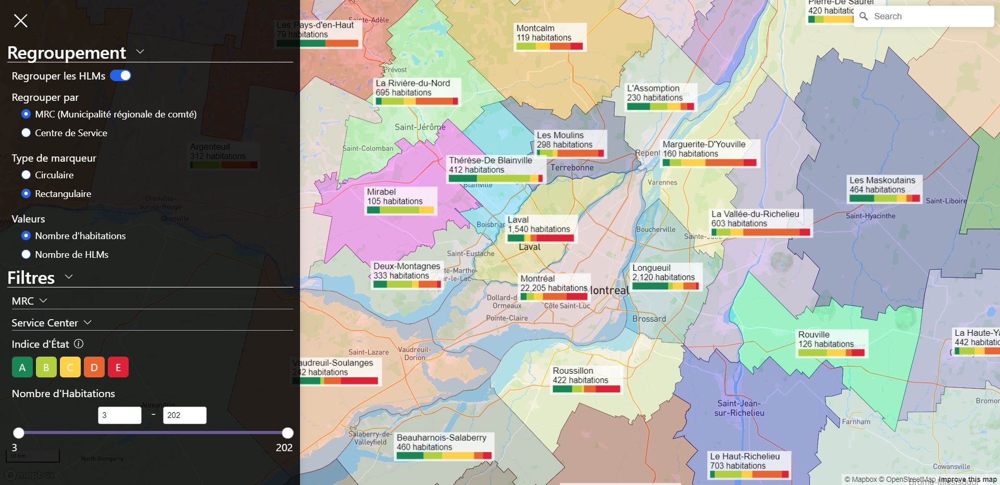
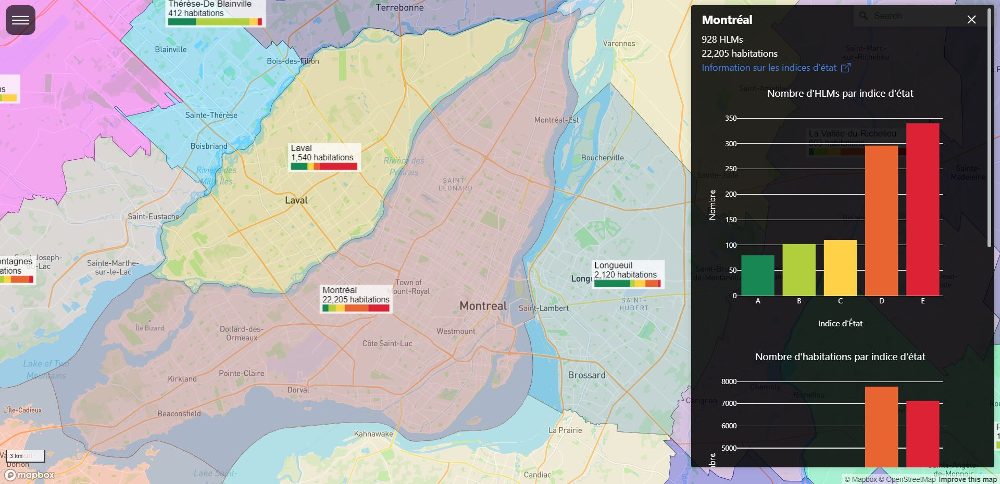
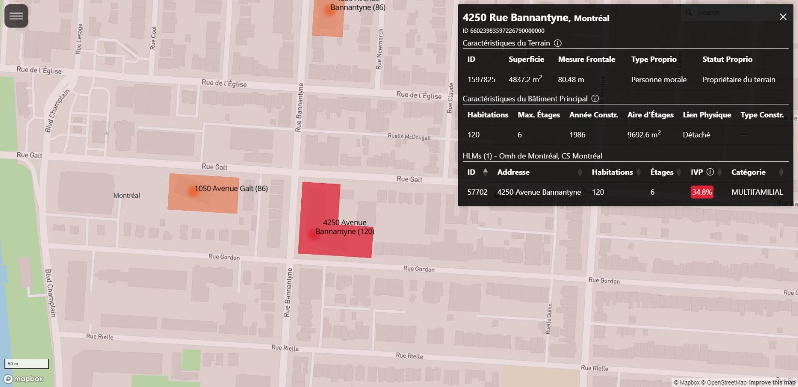

# Quebec HLM Explorer

An interactive map visualization of the HLMs in Québec. Available in French only for now.

The live version can be accessed at [https://hlms-lhovon.pythonanywhere.com/](https://hlms-lhovon.pythonanywhere.com/)






The project uses Mapbox for the interactive map, a simple flask server and a PostGIS database to serve data and perform any geographic operations.

Note: you will need a [Mapbox API key](https://docs.mapbox.com/help/getting-started/access-tokens/) - the free plan provides all that is needed

# Installation

```bash
# Create a new virtual env
python -m venv .venv
# Activate the virtual env
.venv\Scripts\activate # (windows)
source .venv/bin/activate # (linux/mac)
# Install project dependencies
pip install -r requirements.txt
# Copy the example env file -- you will have to fill it in with values defined below
cp .env.example .env
```

Now fill in the `.env` file with you DB connection values (more on setting up DB below) and Mapbox API key.

## Get the data
This project uses a PostGIS database to handle the geo computations. You need to download and install [PostgreSQL](https://www.postgresql.org/download/) and the [PostGIS extension](https://postgis.net/documentation/getting_started/). Then setup the default admin user `postgres` with a password. I will assume it is running on `localhost` at the default port `5432`, change the values below as appropriate based on your setup.

Download a dump of the database [here](https://f005.backblazeb2.com/file/bit-data-public/exploredb_20240114.sql). Before we can load it, we'll have to create a user and a database. 

Run the following in the PostgreSQL command line (`psql`):

```sql
--- Create a user for the database (called bitdbuser as it's the name used in the dump - you can rename it after)
CREATE USER bitdbuser WITH PASSWORD <your-password>;
ALTER ROLE bitdbuser SET client_encoding TO 'utf8';
ALTER ROLE bitdbuser SET default_transaction_isolation TO 'read committed';
ALTER ROLE bitdbuser SET timezone TO 'UTC';
ALTER USER bitdbuser SUPERUSER; 

--- Create an empty database and give admin access to your user
CREATE DATABASE <your-db-name> OWNER bitdbuser LC_COLLATE 'en_US.UTF-8' LC_CTYPE 'en_US.UTF-8' TEMPLATE 'template0';
GRANT ALL PRIVILEGES ON DATABASE <your-db-name> TO bitdbuser;

-- Connect to the DB and activate the extensions
\c <your-db-name> 
CREATE EXTENSION postgis; -- activate the PostGIS extension for geographic calculations
```

Now exit `psql` and at the terminal run the following to load the dump into your database:
```
psql -d postgresql://bitdbuser:<your-password>@localhost:5432/<your-db-name> -f .\exploredb_20240114.sql -v ON_ERROR_STOP=1
```

Finally, copy `.env.example` to `.env` and fill in the values with the ones you've chosen for the bitdbuser's password, database name, as well as your mapbox token.

## Run the server locally

You should now be able to run the application locally and access it in a web browser at the address given by the following command.

```
flask --app server.py run
```


# Recreate the database from scratch


Alternatively, you can re-create the database from scratch by following the instructions in the [BIT project's README](https://github.com/ReCONstruct-Digital-Platform/Building-Identification-Tool) and the additional instructions that follow. The dump only contains the necessary data for this project, whereas the BIT DB has additional tables which could be used to extend this project.


## Additional steps after re-creating the BIT DB

Perform the following steps after completing the steps in [BIT project's README](https://github.com/ReCONstruct-Digital-Platform/Building-Identification-Tool).

### Importing MRC shapefiles
source: https://diffusion.mern.gouv.qc.ca/diffusion/RGQ/Vectoriel/Theme/Regional/SDA_100k/SHP/BDAT(adm)_SHP.zip

These are in reference system 4269!

Unzip the file and move into `Bdat/SHP`, then load the shapefile data into Postgres by running the following.  
```bash
shp2pgsql -D -I -s 4269:4326 mrc_s.shp mrcs | psql postgresql://your-db-connection-string/exploredb
```

If you get a '.dbf can not be opened' error, try changing the file location and retrying the operation.
https://gis.stackexchange.com/questions/74799/postgis-shapefile-loader-2-1-error-dbf-file-can-not-be-opened


Then we'll perform some cleaning up on the data.
First, there are 39 MRCs without a name (labelled as 'Nouveau toponyme à venir'), let's delete them.

```sql
delete from mrcs where gid in (2,3,4,31,10,11,12,13,14,32,15,16,33,34,17,18,19,20,22,25,26,36,28,35,37,38,29,30,39,42,43,44,45,47,48,49,50,51,52);
```

Next, some MRCs have mulitple disjoint entries - let's unite them into a single one with a unified geometry.
```
Caniapiscau                 |     4 | {6,7,8,9}
Lac-Saint-Jean-Est          |     2 | {59,61}
Le Golfe-du-Saint-Laurent   |     2 | {147,148}
Minganie                    |     2 | {145,146}
```


We will insert new entries with unified polygons, keeping the first value of the name and other fields. We recalculate the area and perimeter for the new entries since the geometries are different. Note that we take the opportunity to simplify the geometries as well - this reduces the data size significantly and thus load times. 

```sql
insert into mrcs(area, perimeter, mrc_s_, mrc_s_id, mrs_no_ind, mrs_de_ind, mrs_co_mrc, mrs_nm_mrc, mrs_co_reg, mrs_nm_reg, mrs_co_ref, mrs_co_ver, geom) select st_area(ST_Union(geom)), st_perimeter(st_union(geom)), (array_agg(mrc_s_))[1], (array_agg(mrc_s_id))[1], (array_agg(mrs_no_ind))[1], (array_agg(mrs_de_ind))[1], (array_agg(mrs_co_mrc))[1], mrs_nm_mrc, (array_agg(mrs_co_reg))[1], (array_agg(mrs_nm_reg))[1], (array_agg(mrs_co_ref))[1], (array_agg(mrs_co_ver))[1], ST_Multi(ST_Union(ST_Simplify(geom, 0.00085))) from mrcs group by mrs_nm_mrc having count(*) > 1;
```

Then we delete the previous entries
```sql
delete from mrcs where gid in (6,7,8,9,59,61,145,146,147,148);
```

For convenience, we will also rename the id and name columns
```sql
alter table mrcs rename gid to id; 
alter table mrcs rename mrs_nm_mrc to name;
```


# Speeding up polygon loading

Use [`ST_Simplify`](https://postgis.net/docs/ST_Simplify.html) to vastly speed up loading! It reduces the data size. Play with the tolerance so you don't lose too much accuracy in the resulting shapes.

We'll modify some of the largest polygons in the DB directly as we'll probably never need this level of detail

```sql
--- You can list them in order of polygon size and check the impact of a simplify operations with various tolerances
select id, name, st_npoints(geom), st_npoints(st_simplify(geom, 0.0009)) from mrcs order by st_npoints(geom) desc;

--- update the largest ones
update mrcs set geom = st_simplify(geom, 0.005) where id in (1, 5, 21, 24, 78, 40, 58, 77, 80, 85, 23);
```

Even after this, we'll still call simplify when returning the polygons from the DB in `server.py`


# Service Center polygons

To optimize, we create a new table of service_center polygons, with an id and their area.
This will save us from reforming the polygons manually each time, and calculating their area.

We use concave hull and buffer to create a polygon showing the extent of the hlms within each service center.
concav hull create the polygon.
ST_ConcaveHull(ST_Union(point), 0.5, false)

```sql
create table if not exists sc (
   id serial primary key,
   name text not null,
   area numeric,
   geom geometry(Polygon, 4326)
);

--- ConcaveHull draws a polygon around a set of points
--- https://postgis.net/docs/ST_ConcaveHull.html
INSERT INTO sc (name, area, geom) SELECT service_center AS name, ST_Area(ST_ConcaveHull(ST_Union(point), 0.5)) AS area, ST_simplify(ST_buffer(ST_ConcaveHull(ST_Union(point), 0.5, false), 0.01), 0.1) AS geom FROM hlms GROUP BY service_center ORDER BY ST_Area(ST_ConcaveHull(ST_Union(point), 0.5)) DESC;

--- Raname CS HMN to its full name
update sc set name = 'CS Habitat Métis Nord (HMN)' where id = 1;
```


# Development Notes

## Tailwind 
If developing, download [TailwindCSS](https://tailwindcss.com/docs/installation) and run the processor to automatically regenerate the CSS file.
```bash
`npx tailwindcss -i ./static/input.css -o ./static/styles.css --watch`
```

## Clustering
We don't use mapbox's clustering feature anymore but instead cluster the data ourselves on the server and return single points.
I opted for this to reduce the amount of data transferred every time the cluster settings would change, facilitate the management of custom cluster markers, and because I found the 'splitting up' of clusters into smaller units as we zoomed undesirable in cluster mode. 

## Filtering
We use an include list (list of poylgons to be displayed) for mapbox layers and SQL


## Composing the filters into SQL

Only if both no MRC and no SC are selected - so both lists are empty should we show no data.
If either of them is full, we should show all the data.
If both are full, we should show all the data. (included in the above)
If one is empty and the other one has some value, only show HLMs within that value.
If both have some values, show HLMs in all the values (OR combination) -- not the intersection of all!

Translating these requirements into SQL is done in the server.
In the default case where we want all data - when either MRC or SC list is full - we won't include a WHERE clause as an optimization.
A big where clause checking for inclusion in the two lists would be slow!
We join the mrcs and sc tables as needed to optimize query completion time - joining on both tables singificantly impacts query time! 

## I18n/Translation

Dynamic translation between french and english is achieved through different means based on the source of the text.

For static text within the main HTML template, we identify all translatable elements with a `lang` attribute on the ancestor and a `data-key` attribute on the text element. Javascript code will run and lookup the trabslation in the `langdata` object for the selected locale.

For server generated text, we do a similar thing on the server, looking up the translation of each string in a dictionary.
   